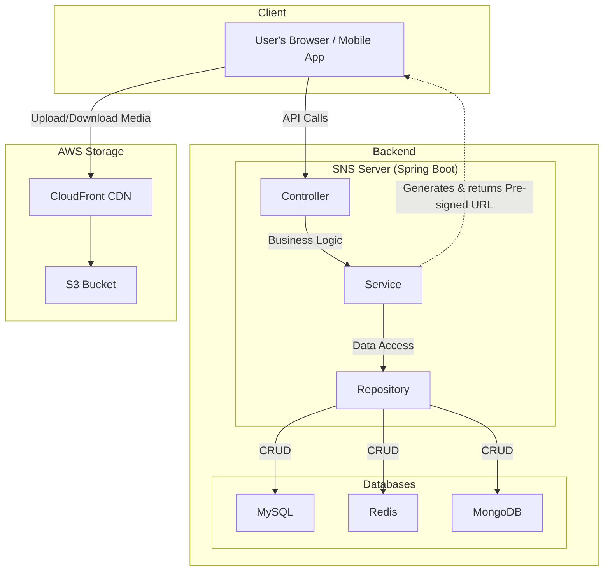

# SNS Service - Backend Server

이 프로젝트는 SNS(소셜 네트워킹 서비스)의 백엔드 서버입니다. Spring Boot를 기반으로 구축되었으며, 사용자 인증, 게시물 관리, 실시간 채팅, 팔로우 등 다양한 소셜 미디어 기능을 제공합니다.

## ✨ 주요 기능

- **사용자 인증**: JWT(JSON Web Token)를 이용한 안전한 회원가입 및 로그인/로그아웃 기능
- **게시물**: 게시글 및 댓글 작성, 조회, 수정, 삭제
- **팔로우**: 다른 사용자를 팔로우하고 팔로워/팔로잉 목록 관리
- **실시간 채팅**: WebSocket을 활용한 1:1 실시간 채팅 기능
- **알림**: 팔로우, 댓글 등 주요 이벤트에 대한 실시간 알림
- **회원 관리**: 사용자 프로필 조회 및 수정

## 🏛️ 아키텍처



## 🛠️ 기술 스택

### Backend
- **Java 21**
- **Spring Boot 3.5.3**
- **Spring Data JPA** & **QueryDSL**: 데이터베이스 쿼리
- **Spring Security** & **JWT**: 인증 및 인가
- **Spring Web**: RESTful API
- **Spring Boot Starter WebSocket**: 실시간 통신
- **Spring Data Redis**: 캐싱 및 실시간 메시징
- **Spring Data MongoDB**: 채팅 메시지 저장

### Database
- **MySQL**: 주요 데이터 저장
- **H2 Database**: 테스트용 인메모리 데이터베이스
- **Flyway**: 데이터베이스 스키마 버전 관리

### DevOps & Tools
- **Gradle**: 의존성 관리 및 빌드
- **Docker**: 애플리케이션 컨테이너화
- **AWS S3 & CloudFront**: 이미지 등 정적 파일 저장 및 전송
- **SpringDoc (Swagger UI)**: API 문서 자동화
- **Jacoco**: 테스트 커버리지 리포트

## 🚀 시작하기

### 사전 요구 사항

- Java 21
- Gradle 8.x 이상
- MySQL (또는 Docker)

### 로컬 환경에서 실행하기

1. **저장소 복제:**
   ```bash
   git clone https://github.com/your-username/sns1-server.git
   cd sns1-server
   ```

2. **application.yml 설정:**
   `src/main/resources/` 경로의 `application-dev_db.yml`, `application-dev_auth.yml` 등 설정 파일을 자신의 로컬 환경에 맞게 수정합니다. (DB 접속 정보, JWT 시크릿 키 등)

3. **애플리케이션 실행:**
   ```bash
   ./gradlew bootRun
   ```
   서버는 기본적으로 8080 포트에서 실행됩니다.

### Docker로 실행하기

1. **Docker 이미지 빌드:**
   ```bash
   docker build -t sns1-server .
   ```

2. **Docker Compose 실행:**
   `docker-compose.yml` 파일에 정의된 서비스를 실행합니다.
   ```bash
   docker-compose up -d
   ```

## 📖 API 문서

애플리케이션 실행 후, 아래 주소에서 API 문서를 확인할 수 있습니다.
- **Swagger UI**: [http://localhost:8080/swagger-ui.html](http://localhost:8080/swagger-ui.html)

## 📁 프로젝트 구조

```
.
├── src
│   ├── main
│   │   ├── java/com/mysite/sns1_server
│   │   │   ├── domain          # 비즈니스 로직 (Controller, Service, Repository, DTO)
│   │   │   │   ├── auth
│   │   │   │   ├── member
│   │   │   │   ├── post
│   │   │   │   ├── follow
│   │   │   │   ├── chat
│   │   │   │   └── ...
│   │   │   ├── global          # 전역 설정 및 공통 모듈 (Security, Exception, Config)
│   │   │   └── Sns1ServerApplication.java
│   │   └── resources
│   │       ├── application.yml # 공통 설정
│   │       ├── config          # 환경별(dev, prod) 설정 파일
│   │       └── db/migration    # Flyway DB 마이그레이션 스크립트
│   └── test                    # 테스트 코드
├── build.gradle                # 프로젝트 의존성 및 빌드 설정
├── Dockerfile                  # Docker 이미지 생성을 위한 설정
└── docker-compose.yml          # Docker 컨테이너 실행을 위한 설정
```
